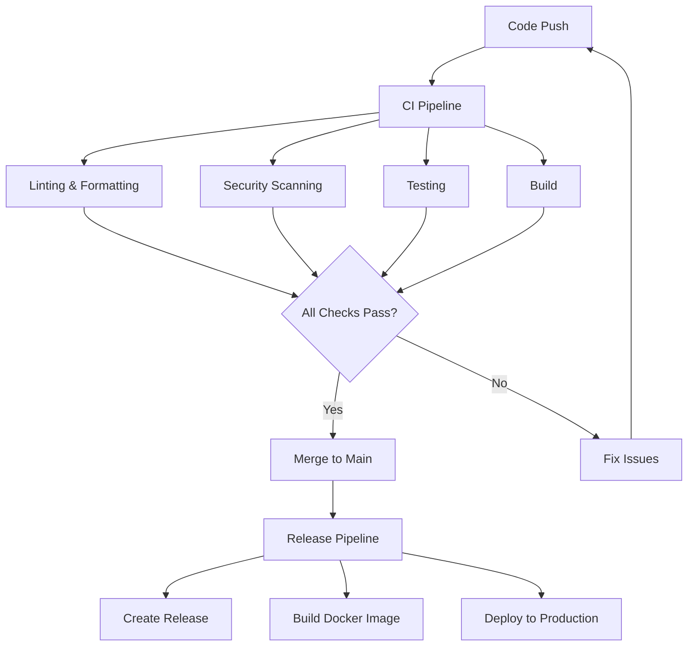

# CI/CD Pipeline Documentation

This document describes the Continuous Integration and Continuous Deployment pipeline configuration for the Crypto Trading Bot project.

## 📋 Table of Contents

- [Pipeline Overview](#pipeline-overview)
- [GitHub Actions Workflows](#github-actions-workflows)
- [Pipeline Configuration](#pipeline-configuration)
- [Security and Secrets](#security-and-secrets)
- [Deployment Strategies](#deployment-strategies)
- [Monitoring and Notifications](#monitoring-and-notifications)

## 🔄 Pipeline Overview

The CI/CD pipeline consists of two main workflows:

1. **Continuous Integration (CI)** - `.github/workflows/ci.yml`
2. **Release Automation** - `.github/workflows/release.yml`

### Pipeline Flow



## 🚀 GitHub Actions Workflows

### CI Workflow (ci.yml)

The CI workflow runs on every push and pull request to ensure code quality and functionality.

#### Triggers
```yaml
on:
  push:
    branches: [ main, develop ]
  pull_request:
    branches: [ main ]
```

#### Jobs

1. **Lint and Format Check**
   - Runs flake8 for linting
   - Checks black formatting
   - Validates isort import sorting

2. **Security Scan**
   - Bandit security analysis
   - Safety dependency vulnerability check
   - CodeQL analysis (GitHub's semantic code analysis)

3. **Test Matrix**
   - Python versions: 3.9, 3.10, 3.11
   - Operating systems: Ubuntu, Windows, macOS
   - Fail-fast disabled to run all combinations

4. **Build Verification**
   - Package building test
   - Docker image build (when enabled)

5. **Coverage Reporting**
   - pytest with coverage
   - Codecov integration
   - Coverage reports and badges

#### Example Configuration

```yaml
name: CI

on:
  push:
    branches: [ main, develop ]
  pull_request:
    branches: [ main ]

jobs:
  lint:
    runs-on: ubuntu-latest
    steps:
      - uses: actions/checkout@v4
      - name: Set up Python
        uses: actions/setup-python@v5
        with:
          python-version: '3.11'
          cache: 'pip'
      
      - name: Install dependencies
        run: |
          python -m pip install --upgrade pip
          pip install flake8 black isort bandit safety
      
      - name: Lint with flake8
        run: flake8 src/ tests/ --count --statistics
      
      - name: Check formatting with black
        run: black --check src/ tests/
      
      - name: Check import sorting with isort
        run: isort --check-only src/ tests/

  security:
    runs-on: ubuntu-latest
    steps:
      - uses: actions/checkout@v4
      - name: Set up Python
        uses: actions/setup-python@v5
        with:
          python-version: '3.11'
      
      - name: Install dependencies
        run: |
          python -m pip install --upgrade pip
          pip install bandit safety
      
      - name: Security scan with bandit
        run: bandit -r src/ -f json -o bandit-report.json
      
      - name: Check dependencies with safety
        run: safety check --json --output safety-report.json

  test:
    runs-on: ${{ matrix.os }}
    strategy:
      fail-fast: false
      matrix:
        os: [ubuntu-latest, windows-latest, macos-latest]
        python-version: ['3.9', '3.10', '3.11']
    
    steps:
      - uses: actions/checkout@v4
      - name: Set up Python ${{ matrix.python-version }}
        uses: actions/setup-python@v5
        with:
          python-version: ${{ matrix.python-version }}
          cache: 'pip'
      
      - name: Install dependencies
        run: |
          python -m pip install --upgrade pip
          pip install -r requirements.txt
          pip install -r requirements-dev.txt
      
      - name: Run tests with coverage
        run: |
          pytest tests/ -v --cov=src --cov-report=xml --cov-report=html
      
      - name: Upload coverage to Codecov
        if: matrix.os == 'ubuntu-latest' && matrix.python-version == '3.11'
        uses: codecov/codecov-action@v3
        with:
          file: ./coverage.xml
          flags: unittests
          name: codecov-umbrella
```

### Release Workflow (release.yml)

The release workflow automates the creation of releases and deployment.

#### Triggers
```yaml
on:
  push:
    tags:
      - 'v*'
```

#### Jobs

1. **Create Release**
   - Generates release notes
   - Creates GitHub release
   - Uploads build artifacts

2. **Docker Build and Push**
   - Builds Docker image
   - Tags with version and latest
   - Pushes to Docker Hub/Registry

3. **Deploy to Production**
   - Updates production environment
   - Runs deployment scripts
   - Notifies stakeholders

#### Example Configuration

```yaml
name: Release

on:
  push:
    tags:
      - 'v*'

jobs:
  release:
    runs-on: ubuntu-latest
    steps:
      - uses: actions/checkout@v4
      
      - name: Set up Python
        uses: actions/setup-python@v5
        with:
          python-version: '3.11'
      
      - name: Build package
        run: |
          python -m pip install --upgrade pip build
          python -m build
      
      - name: Create Release
        uses: softprops/action-gh-release@v1
        with:
          files: dist/*
          generate_release_notes: true
        env:
          GITHUB_TOKEN: ${{ secrets.GITHUB_TOKEN }}

  docker:
    runs-on: ubuntu-latest
    needs: release
    steps:
      - uses: actions/checkout@v4
      
      - name: Set up Docker Buildx
        uses: docker/setup-buildx-action@v3
      
      - name: Login to Docker Hub
        uses: docker/login-action@v3
        with:
          username: ${{ secrets.DOCKER_USERNAME }}
          password: ${{ secrets.DOCKER_PASSWORD }}
      
      - name: Extract metadata
        id: meta
        uses: docker/metadata-action@v5
        with:
          images: your-dockerhub-username/crypto-trading-bot
          tags: |
            type=ref,event=tag
            type=raw,value=latest
      
      - name: Build and push
        uses: docker/build-push-action@v5
        with:
          context: .
          push: true
          tags: ${{ steps.meta.outputs.tags }}
          labels: ${{ steps.meta.outputs.labels }}
```

## ⚙️ Pipeline Configuration

### Environment Variables

Set these in GitHub repository settings → Secrets and variables → Actions:

#### Repository Secrets
```bash
# Docker Hub credentials
DOCKER_USERNAME=your_dockerhub_username
DOCKER_PASSWORD=your_dockerhub_password

# API credentials for testing
TEST_API_KEY=your_test_api_key
TEST_API_SECRET=your_test_api_secret

# Codecov token
CODECOV_TOKEN=your_codecov_token

# Notification webhooks
SLACK_WEBHOOK_URL=your_slack_webhook
DISCORD_WEBHOOK_URL=your_discord_webhook

# Cloud deployment credentials
AWS_ACCESS_KEY_ID=your_aws_access_key
AWS_SECRET_ACCESS_KEY=your_aws_secret_key
GOOGLE_CLOUD_KEY=your_gcp_service_account_key
AZURE_CREDENTIALS=your_azure_credentials
```

#### Repository Variables
```bash
# Environment configuration
ENVIRONMENT=production
LOG_LEVEL=INFO

# Application settings
DEFAULT_SYMBOL=BTCUSDT
DEFAULT_TIMEFRAME=1h
```

### Branch Protection Rules

Configure branch protection for `main` branch:

```yaml
# Settings → Branches → Add rule
Branch name pattern: main

Protection rules:
☑ Require a pull request before merging
  ☑ Require approvals: 1
  ☑ Dismiss stale PR approvals when new commits are pushed
  ☑ Require review from code owners

☑ Require status checks to pass before merging
  ☑ Require branches to be up to date before merging
  Required status checks:
    - lint
    - security
    - test (ubuntu-latest, 3.11)
    - test (windows-latest, 3.11)
    - test (macos-latest, 3.11)

☑ Require conversation resolution before merging
☑ Restrict pushes that create files larger than 100 MB
☑ Do not allow bypassing the above settings
```

### Workflow Permissions

```yaml
# .github/workflows/ci.yml
permissions:
  contents: read
  security-events: write
  pull-requests: write

# .github/workflows/release.yml
permissions:
  contents: write
  packages: write
```

## 🔐 Security and Secrets

### Secret Management Best Practices

1. **Never commit secrets to repository**
2. **Use GitHub Secrets for sensitive data**
3. **Rotate secrets regularly**
4. **Use least privilege principle**
5. **Audit secret access regularly**

### Security Scanning Tools

#### Bandit Configuration
```yaml
# .bandit
[bandit]
exclude_dirs = ["/tests"]
skips = ["B101", "B601"]  # Skip assert_used_in_tests, paramiko_calls

# Custom rules
[bandit.plugins.hardcoded_password_string]
word_list = ["password", "pass", "passwd", "pwd", "secret", "token"]
```

#### Safety Configuration
```yaml
# .safety-policy.yml
security:
  ignore-vulnerabilities:
    # Ignore specific vulnerabilities with justification
    - id: 12345
      reason: "False positive - not applicable to our use case"
      expires: "2024-12-31"
```

### CodeQL Configuration
```yaml
# .github/codeql/codeql-config.yml
name: "CodeQL Config"

queries:
  - uses: security-and-quality
  - uses: security-extended

paths-ignore:
  - "tests/**"
  - "docs/**"
  - "*.md"
```

## 🚀 Deployment Strategies

### Blue-Green Deployment

```yaml
# .github/workflows/deploy-blue-green.yml
name: Blue-Green Deployment

on:
  workflow_run:
    workflows: ["Release"]
    types:
      - completed

jobs:
  deploy:
    if: ${{ github.event.workflow_run.conclusion == 'success' }}
    runs-on: ubuntu-latest
    
    steps:
      - name: Deploy to Blue Environment
        run: |
          # Deploy to blue environment
          kubectl set image deployment/crypto-bot-blue \
            crypto-bot=your-registry/crypto-trading-bot:${{ github.sha }} \
            -n production
      
      - name: Health Check Blue Environment
        run: |
          # Wait for deployment and health check
          kubectl rollout status deployment/crypto-bot-blue -n production
          curl -f http://blue.crypto-bot.com/health
      
      - name: Switch Traffic to Blue
        run: |
          # Update service to point to blue deployment
          kubectl patch service crypto-bot-service \
            -p '{"spec":{"selector":{"version":"blue"}}}' \
            -n production
      
      - name: Cleanup Green Environment
        run: |
          # Scale down green deployment
          kubectl scale deployment crypto-bot-green --replicas=0 -n production
```

### Rolling Deployment

```yaml
# .github/workflows/deploy-rolling.yml
name: Rolling Deployment

on:
  workflow_run:
    workflows: ["Release"]
    types:
      - completed

jobs:
  deploy:
    runs-on: ubuntu-latest
    
    steps:
      - name: Rolling Update
        run: |
          kubectl set image deployment/crypto-trading-bot \
            crypto-trading-bot=your-registry/crypto-trading-bot:${{ github.sha }} \
            -n production
          
          kubectl rollout status deployment/crypto-trading-bot -n production
      
      - name: Health Check
        run: |
          # Wait for pods to be ready
          kubectl wait --for=condition=ready pod \
            -l app=crypto-trading-bot \
            -n production \
            --timeout=300s
```

### Canary Deployment

```yaml
# .github/workflows/deploy-canary.yml
name: Canary Deployment

on:
  workflow_run:
    workflows: ["Release"]
    types:
      - completed

jobs:
  canary:
    runs-on: ubuntu-latest
    
    steps:
      - name: Deploy Canary (10%)
        run: |
          # Deploy canary version
          kubectl set image deployment/crypto-bot-canary \
            crypto-bot=your-registry/crypto-trading-bot:${{ github.sha }} \
            -n production
          
          # Scale canary to 10% of traffic
          kubectl scale deployment crypto-bot-canary --replicas=1 -n production
          kubectl scale deployment crypto-bot-stable --replicas=9 -n production
      
      - name: Monitor Canary
        run: |
          # Monitor metrics for 10 minutes
          sleep 600
          
          # Check error rates and performance metrics
          ERROR_RATE=$(curl -s http://prometheus:9090/api/v1/query?query=rate(http_requests_total{status=~"5.."}[5m]) | jq '.data.result[0].value[1]')
          
          if (( $(echo "$ERROR_RATE > 0.01" | bc -l) )); then
            echo "High error rate detected: $ERROR_RATE"
            exit 1
          fi
      
      - name: Promote Canary
        run: |
          # If canary is healthy, promote to 100%
          kubectl set image deployment/crypto-bot-stable \
            crypto-bot=your-registry/crypto-trading-bot:${{ github.sha }} \
            -n production
          
          kubectl scale deployment crypto-bot-stable --replicas=10 -n production
          kubectl scale deployment crypto-bot-canary --replicas=0 -n production
```

## 📊 Monitoring and Notifications

### Pipeline Monitoring

```yaml
# .github/workflows/monitor-pipeline.yml
name: Pipeline Monitoring

on:
  workflow_run:
    workflows: ["CI", "Release"]
    types:
      - completed

jobs:
  notify:
    runs-on: ubuntu-latest
    
    steps:
      - name: Notify Slack on Success
        if: ${{ github.event.workflow_run.conclusion == 'success' }}
        uses: 8398a7/action-slack@v3
        with:
          status: success
          channel: '#deployments'
          webhook_url: ${{ secrets.SLACK_WEBHOOK_URL }}
          message: |
            ✅ Pipeline succeeded for ${{ github.event.workflow_run.name }}
            Commit: ${{ github.event.workflow_run.head_commit.message }}
            Author: ${{ github.event.workflow_run.head_commit.author.name }}
      
      - name: Notify Slack on Failure
        if: ${{ github.event.workflow_run.conclusion == 'failure' }}
        uses: 8398a7/action-slack@v3
        with:
          status: failure
          channel: '#alerts'
          webhook_url: ${{ secrets.SLACK_WEBHOOK_URL }}
          message: |
            ❌ Pipeline failed for ${{ github.event.workflow_run.name }}
            Commit: ${{ github.event.workflow_run.head_commit.message }}
            Author: ${{ github.event.workflow_run.head_commit.author.name }}
            Please check the logs: ${{ github.event.workflow_run.html_url }}
```

### Custom Metrics Collection

```yaml
# .github/workflows/collect-metrics.yml
name: Collect Pipeline Metrics

on:
  workflow_run:
    workflows: ["CI"]
    types:
      - completed

jobs:
  metrics:
    runs-on: ubuntu-latest
    
    steps:
      - name: Collect Build Metrics
        run: |
          # Send metrics to monitoring system
          curl -X POST "https://your-metrics-endpoint.com/api/metrics" \
            -H "Authorization: Bearer ${{ secrets.METRICS_TOKEN }}" \
            -H "Content-Type: application/json" \
            -d '{
              "pipeline": "${{ github.event.workflow_run.name }}",
              "status": "${{ github.event.workflow_run.conclusion }}",
              "duration": "${{ github.event.workflow_run.updated_at - github.event.workflow_run.created_at }}",
              "commit": "${{ github.event.workflow_run.head_sha }}",
              "branch": "${{ github.event.workflow_run.head_branch }}",
              "timestamp": "${{ github.event.workflow_run.updated_at }}"
            }'
```

### Health Checks

```yaml
# .github/workflows/health-check.yml
name: Production Health Check

on:
  schedule:
    - cron: '*/5 * * * *'  # Every 5 minutes

jobs:
  health-check:
    runs-on: ubuntu-latest
    
    steps:
      - name: Check Application Health
        run: |
          HEALTH_URL="https://your-app.com/health"
          
          if ! curl -f --max-time 30 "$HEALTH_URL"; then
            echo "Health check failed!"
            
            # Send alert
            curl -X POST "${{ secrets.SLACK_WEBHOOK_URL }}" \
              -H 'Content-type: application/json' \
              --data '{
                "text": "🚨 Production health check failed!",
                "channel": "#alerts",
                "username": "Health Check Bot"
              }'
            
            exit 1
          fi
          
          echo "Health check passed ✅"
```

## 🔧 Troubleshooting

### Common Pipeline Issues

#### 1. Test Failures
```bash
# Debug test failures
pytest tests/ -v --tb=long --capture=no

# Run specific failing test
pytest tests/test_specific.py::test_function -v -s

# Check test environment
pytest --collect-only
```

#### 2. Docker Build Issues
```bash
# Build locally to debug
docker build -t crypto-trading-bot:debug .

# Check build context
docker build --no-cache --progress=plain -t crypto-trading-bot:debug .

# Inspect layers
docker history crypto-trading-bot:debug
```

#### 3. Deployment Failures
```bash
# Check deployment status
kubectl rollout status deployment/crypto-trading-bot -n production

# View pod logs
kubectl logs -f deployment/crypto-trading-bot -n production

# Describe deployment
kubectl describe deployment crypto-trading-bot -n production
```

### Pipeline Debugging

#### Enable Debug Logging
```yaml
# Add to workflow
- name: Enable Debug Logging
  run: echo "ACTIONS_STEP_DEBUG=true" >> $GITHUB_ENV
```

#### Artifact Collection
```yaml
# Collect debug artifacts
- name: Upload Debug Artifacts
  if: failure()
  uses: actions/upload-artifact@v4
  with:
    name: debug-artifacts
    path: |
      logs/
      coverage.xml
      bandit-report.json
      safety-report.json
```

### Performance Optimization

#### Cache Optimization
```yaml
# Optimize pip cache
- name: Cache pip dependencies
  uses: actions/cache@v3
  with:
    path: ~/.cache/pip
    key: ${{ runner.os }}-pip-${{ hashFiles('**/requirements*.txt') }}
    restore-keys: |
      ${{ runner.os }}-pip-

# Cache Docker layers
- name: Cache Docker layers
  uses: actions/cache@v3
  with:
    path: /tmp/.buildx-cache
    key: ${{ runner.os }}-buildx-${{ github.sha }}
    restore-keys: |
      ${{ runner.os }}-buildx-
```

#### Parallel Execution
```yaml
# Run jobs in parallel
jobs:
  lint:
    # ...
  
  test:
    # ...
  
  security:
    # ...
  
  # All jobs run in parallel by default
```

This CI/CD documentation provides a comprehensive guide for maintaining and extending the pipeline. The configuration ensures code quality, security, and reliable deployments while providing visibility into the process through monitoring and notifications.
